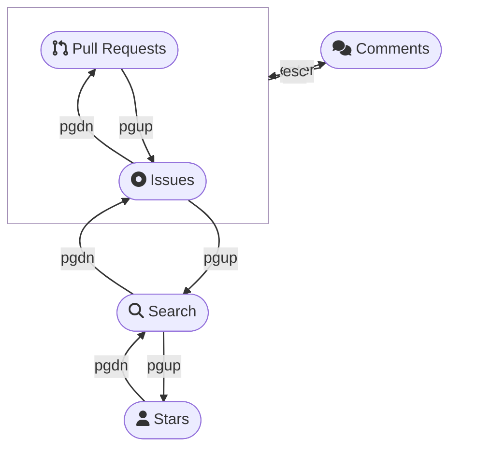

<div align="center">

# gh look

Drop an emoji, write comments, star repositories, read the preview or browse the issue tracker. All interactively by combining `gh` with `fzf`.


</div>

---

## 💻 Requirements
Install [Fuzzy Finder (fzf)](https://github.com/junegunn/fzf#installation)  and the [GitHub command line tool (gh)](https://github.com/cli/cli#installation), for example through Homebrew.

Optionally, also install [bat](https://github.com/sharkdp/bat#installation) to beautify the preview.

```zsh
brew install fzf gh bat

# install this extension
gh ext install LangLangBart/gh-look
# upgrade
gh ext upgrade LangLangBart/gh-look
# uninstall
gh ext remove LangLangBart/gh-look
```

---

## 👨‍💻 Usage

```
gh look [Command] [-Flags] [Search term]
```

| Command | Description                                                     | Example                               |
| :------ | :-------------------------------------------------------------- | :------------------------------------ |
| issue   | List Issues                                                     | gh look issue -r cli/cli involves:@me |
| pr      | List Pull Requests                                              | gh look pr                            |
| search  | Search 🔎 for GitHub repos                                       | gh look search keycastr               |
| star    | List starred ⭐️ repos (sorted by the time the user set the star) | gh look star                          |

| Flags | All commands                                                        | Example                     |
| :---- | :------------------------------------------------------------------ | :-------------------------- |
| -c    | Cache the response, for example `30s`, `15m`, `1h` (default: `20s`) | gh look star -c 15m         |
| -w    | Display the preview window upon start (default: hidden)             | gh look issue -w -r cli/cli |

| Flags | Issue/ pr command                                    | Example                      |
| :---- | :--------------------------------------------------- | :--------------------------- |
| -e    | Emoji to make a reaction[^1] (default: THUMBS_UP 👍 ) | gh look pr -e CONFUSED       |
| -o    | sorting order[^2] (default: created-desc)            | gh look issue -o updated-asc |
| -r    | Specify a repository (form: OWNER/REPO)              | gh look pr -r cli/cli        |

| Flags | Star ⭐️ command             | Example                |
| :---- | :------------------------- | :--------------------- |
| -u    | List stars of another user | gh look star -u ashtom |


[^1]: Valid emojis {THUMBS_UP 👍, THUMBS_DOWN 👎, LAUGH 😄, HOORAY 🎉, CONFUSED 😕, HEART ❤️, ROCKET 🚀, EYES 👀}
[^2]: Valid Ordering options {author-date,committer-date,created,interactions,reactions,updated}-{desc,asc}
  [GitHub Docs - Searching on GitHub](https://docs.github.com/en/search-github/searching-on-github)


### Hotkeys
- <kbd>?</kbd> shows a list of specific hotkeys defined for each command.
- <kbd>pgup</kbd>/<kbd>pgdn</kbd> switches between commands (macOS <kbd>fn+↑</kbd>/<kbd>fn+↓</kbd>), comments can be reached with <kbd>enter</kbd>/<kbd>esc</kbd>.



---

## 💪 Contributing
Routine code checks are handled with the [pre-commit](https://github.com/pre-commit/pre-commit) hook, customizations are done in the [.pre-commit-config.yaml](.pre-commit-config.yaml).

> *Pre-commit is a multi-language package manager for pre-commit hooks. You specify a list of hooks you want and **pre-commit manages the installation and execution** of any hook written in any language before every commit. Source: [pre-commit introduction](https://pre-commit.com/#introduction)*

```zsh
# install through homebrew or pip
brew pre-commit
pip install pre-commit

# install the git hook scripts
pre-commit install --hook-type commit-msg --hook-type pre-commit
# pre-commit installed at .git/hooks/commit-msg
# pre-commit installed at .git/hooks/pre-commit

# hook location
.git/hooks/pre-commit
.git/hooks/commit-msg
```

---

## 💁 FAQ

### Strange icons
- [NERD FONT](https://www.nerdfonts.com/cheat-sheet) icons are being used. If you see some `strange` icons, follow the steps in the link to install a better font: [powerlevel10k#fonts](https://github.com/romkatv/powerlevel10k#fonts)
