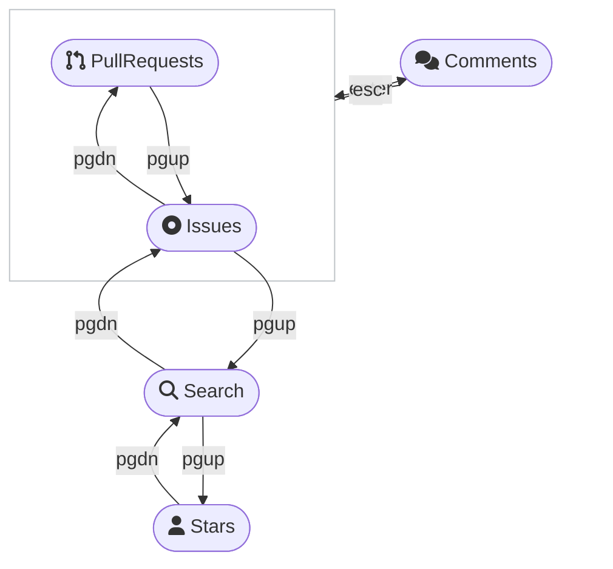

# gh look
Drop an emoji, write comments, star repositories, read the preview or browse the issue tracker. All interactively by combining `gh` with `fzf`.


## 💻 Requirements
Install [Fuzzy Finder (fzf)](https://github.com/junegunn/fzf#installation)  and the [GitHub command line tool (gh)](https://github.com/cli/cli#installation), for example through Homebrew.

Optionally, you can also install [bat](https://github.com/sharkdp/bat#installation) to make the preview more beautiful.

```zsh
brew install fzf gh bat

# install this extension
gh ext install LangLangBart/gh-look
# upgrade
gh ext upgrade LangLangBart/gh-look
# uninstall
gh ext remove LangLangBart/gh-look
```

---

## 👨‍💻 Usage

```
gh look [Command] [-Flags] [Search term]
```

| Command | Description               |
| :------ | :------------------------ |
| issue   | List Issues               |
| pr      | List Pull Requests        |
| search  | Search for GitHub repos   |
| star    | List starred repositories |

| Flags  | Description issue/ pr command                                                                                        | Example                      |
| :----- | :------------------------------------------------------------------------------------------------------------------- | :--------------------------- |
| <none> | List Issues/ Pull Requests                                                                                           | gh look pr                   |
| -c     | Cache the response, for example `30s`, `15m`, `1h` (default: `20s`)                                                  | gh look issue -c 15m         |
| -e     | Emoji to make a reaction (default: THUMBS_UP 👍 ) {CONFUSED,EYES,HEART,HOORAY,LAUGH,THUMBS_DOWN,THUMBS_UP,ROCKET}     | gh look pr -e CONFUSED       |
| -o     | sorting order (default: created-desc) {author-date,committer-date,created,interactions,reactions,updated}-{desc,asc} | gh look issue -o updated-asc |
| -r     | Specify a repository (form: OWNER/REPO)                                                                              | gh look pr -r cli/cli        |
| -w     | Display the preview window upon start (default: hidden)                                                              | gh look issue -wr cli/cli    |

| Flags  | Description search 🔎 command                                        | Example                        |
| :----- | :------------------------------------------------------------------ | :----------------------------- |
| <term> | Search for a repository by name                                     | gh look search keycastr        |
| -c     | Cache the response, for example `30s`, `15m`, `1h` (default: `20s`) | gh look search -c 15m keycastr |
| -w     | Display the preview window upon start (default: hidden)             | gh look search -w keycastr     |

| Flags  | Description star ⭐️ command                                          | Example                 |
| :----- | :------------------------------------------------------------------ | :---------------------- |
| <none> | List your stars (sorted by the time the user set the star)          | gh look star            |
| -c     | Cache the response, for example `30s`, `15m`, `1h` (default: `20s`) | gh look star -c 15m     |
| -u     | List stars of another user                                          | gh look star -u ashtom  |
| -w     | Display the preview window upon start (default: hidden)             | gh look star -wu ashtom |


### HotKeys
- <kbd>?</kbd> shows a list of specific hotkeys defined for each command.
- <kbd>pgup</kbd>/<kbd>pgdn</kbd> switches between commands (macOS <kbd>fn+↑</kbd>/<kbd>fn+↓</kbd>), comments can be reached with <kbd>enter</kbd>/<kbd>esc</kbd>.




---

## 💪 Contributing

### Text validation
`Vale` is a grammar, style, and word usage linter for the English language. The rules are set in the [.vale.ini](.vale.ini) file. It doesn't have a way to auto fix issues at the moment, this must be done manually.

```zsh
# install, for example through Homebrew
brew install vale


# Downloading packages ...
vale sync

# check the repository
vale .
# see even suggestions
vale --minAlertLevel=suggestion .
```

* An optional installation of the [Vale extension](https://marketplace.visualstudio.com/items?itemName=errata-ai.vale-server) to display warnings and errors at once.

---

## 💁 FAQ

1. Icons: [NERD FONT](https://www.nerdfonts.com/cheat-sheet) icons are being used. If you see some "strange" icons, follow the steps in the link to install a better font: [powerlevel10k#fonts](https://github.com/romkatv/powerlevel10k#fonts)
