<div align="center">

# gh look

Drop an emoji, write comments, star repositories, check workflow progress, browse issue trackers, search for repositories, ... all interactively by combining `gh` with `fzf`.


</div>

---

## 💻 Requirements
- [bat](https://github.com/sharkdp/bat#installation) - preview looks better
- [Fuzzy Finder (fzf)](https://github.com/junegunn/fzf#installation) - allow for interaction with listed data
- [GitHub command line tool (gh)](https://github.com/cli/cli#installation) - get the data from Github
- [Python](https://www.python.org) - used to open URLs on different operating systems (`python -m webbrowser <URL>`)

```zsh
brew install fzf gh bat

# install this extension
gh ext install LangLangBart/gh-look
# upgrade
gh ext upgrade LangLangBart/gh-look
# uninstall
gh ext remove LangLangBart/gh-look
```

---

## 👨‍💻 Usage

```sh
gh look [Command] [Flags] [Search term]
```

| Command   | Description                    | Example                               |
| :-------- | :----------------------------- | :------------------------------------ |
| i, issue  | List Issues                    | gh look issue -r cli/cli involves:@me |
| p, pr     | List Pull Requests             | gh look pr -h                         |
| r, run    | List Workflow Runs             | gh look run -r microsoft/vscode -n 20 |
| s, search | Search for GitHub Repositories | gh look search -w keycastr            |
| st, star  | List Starred Repositories      | gh look star -u ashtom                |

- see available `Flags` for each command with `gh look [Command] --help` or interactively with <kbd>?</kbd>

### Hotkeys

```mermaid
%% GitHub seems to not display fontawesome icons
%% https://fontawesome.com/search
%% https://mermaid.js.org/syntax/flowchart.html#basic-support-for-fontawesome

flowchart LR
    subgraph Helper_Keys[ ]
        Help([fa:fa-circle-question ? ᐧ Help])
        ESC([fa:fa-arrow-right-from-bracket esc ᐧ Quit])
    end
    subgraph Overview[ ]
        direction LR
        Search([fa:fa-magnifying-glass Search]) -->|shift+left| Stars([fa:fa-user Stars])
        Stars-->|shift+right| Search
        Search -->|shift+right| Issues([fa:fa-circle-dot Issues])
        Issues -->|shift+left| Search
        subgraph Issue_and_PR[ ]
            Issues --> |shift+right|PullRequests([fa:fa-code-pull-request Pull Requests])
            PullRequests --> |shift+left| Issues
        end
        Issue_and_PR  -->|enter| Comments([fa:fa-comments Comments])  -->|esc| Issue_and_PR
        Workflows([fa:fa-circle-play Workflow Runs]) -->|shift+left| PullRequests
        PullRequests -->|shift+right| Workflows
    end

linkStyle default stroke-width:0.4px
classDef Subgraph_Empty_Style  fill:transparent,stroke-width:0px
class Overview,Helper_Keys Subgraph_Empty_Style
style Issue_and_PR fill:transparent,stroke-width:0.5px,stroke:#5b387c90
```

- switch between commands with <kbd>shift+left</kbd>/<kbd>shift+right</kbd>



---

## 💪 Contributing
Routine code checks are handled with the [pre-commit](https://github.com/pre-commit/pre-commit) hook, customizations are done in the [.pre-commit-config.yaml](.pre-commit-config.yaml).

> *Pre-commit is a multi-language package manager for pre-commit hooks. You specify a list of hooks you want and **pre-commit manages the installation and execution** of any hook written in any language before every commit. Source: [pre-commit introduction](https://pre-commit.com/#introduction)*

```zsh
# install through homebrew or pip
brew pre-commit
pip install pre-commit

# install the git hook scripts
pre-commit install --hook-type commit-msg --hook-type pre-commit
# pre-commit installed at .git/hooks/commit-msg
# pre-commit installed at .git/hooks/pre-commit

# hook location
.git/hooks/pre-commit
.git/hooks/commit-msg
```

---

## 💁 FAQ

### Strange icons
- [NERD FONT](https://www.nerdfonts.com/cheat-sheet) icons are being used. If you see some `strange` icons, follow the steps in the link to install a better font: [powerlevel10k#fonts](https://github.com/romkatv/powerlevel10k#fonts)

### Ordering options
- to change the order in which elements are listed see for details: [GitHub Docs - Searching on GitHub](https://docs.github.com/en/search-github/searching-on-github)
  - Valid Ordering options: {author-date,committer-date,created,interactions,reactions,updated}-{desc,asc}
